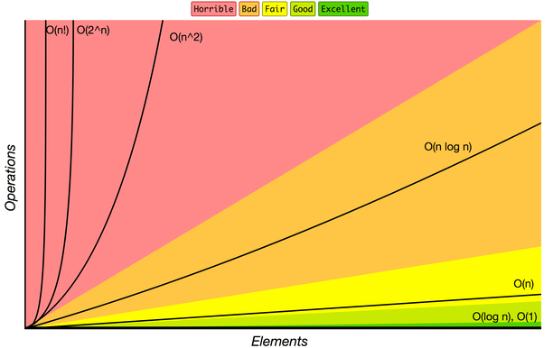

# Cvičení č. 1 – 2.10.2020

## Úvod

*   vzájemné seznámení
*   požadavky a informace budou zde na webu (odkaz najdete i v SISu: naše paralelka → vzkaz pro zapsané studenty)
*   náplň cvičení: algoritmizace (o týden před přednáškou), krátká přestávka, programování (navazujeme na přednášku)
*   **konzultace:** úterý 16:00-18:00, zapište se předem do [tabulky](http://docs.google.com/spreadsheets/d/1yj9CVfraWJXa2gJOmASbjmgY1lU95sujHm9BMjuLyj4/edit?usp=sharing); osobně v Troji / přes Zoom
*   **ReCoDex:** [https://recodex.mff.cuni.cz](http://recodex.mff.cuni.cz)
    *   úlohy na Programování vždy v pátek, na Algoritmizaci několikrát za semestr 
    *   registrace: vybrat _Create account_ a přihlásit se pod školním účtem
    *   pak je možné i vytvořit lokální účet - instrukce [tady](https://github.com/ReCodEx/wiki/wiki/User-documentation), případně se dál přihlašovat pod školním účtem
*   **možnosti doplnění cvičení**: 
    1. tento web 
    2. kódy ze cvičení
    3. nahrané cvičení (Tomáš Holan?) 
    4. e-mail
    5. konzultace

## Algoritmizace
*   brainstorming - co je to algoritmus, vlastnosti algoritmu
    * **problém**: vstup a výstup s požadovanými vlastnostmi
    * **algoritmus**: postup pro řešení problému; požadujeme: vstup, výstup, determinovanost (!=determinismus), konečnost, obecnost, elementární kroky
*   case study na [receptu](https://recepty.vareni.cz/bramboraky/)
*   **asymptotická složitost** - čas, paměť - nezajímá nás konkrétní implementace
*  O-notace - řešíme nejhorší scénář
    * `O(1)`: vstup: čísla od 1 do n; výstup: jejich součet; vzorec `n ( n + 1 ) / 2`
    * `O(log(n))`: vstup: slovník seřazený podle abecedy; výstup: definice hledaného slova; binární vyhledávání   
    * `O(n)`: vstup: text; výstup: text bez diakritiky  
    * `O(n)`: vstup: čísla od 1 do n; výstup: jejich součet; naivní sčítání  
    * `O(n^2)`: vstup: seznam lidí s parametry; výstup: dvojice lidí s kompatibilními parametry  
    * `O(2^n)`: vstup: počet znaků hesla; výstup: uhádnuté heslo (brute-force algoritmus)
    * `O(n!)`: vstup: seznam čísel; výstup: všechny permutace seznamu

        
## Programování
*   povídání o Pythonu - název, rozdíl verze 2 vs. verze 3
*   hrátky s funkcí `print()`, konec řádku, dokumentace vs. hledání na webu
*   vstup: `input()`, přetypování `int()`
*   typy proměnných v Pythonu: funkce `type()`
*   reprezentace čísel: `int` (neomezená přesnost) vs. `float` (omezená přesnost)
    *   co se taky může stát, když si nedáváte pozor: [Patriot](http://www-users.math.umn.edu/~arnold//disasters/patriot.html), [Ariane](https://around.com/ariane.html)
*   cyklus `while`
*   debugging - sledování proměnných
*   podmínka: `if`, `elif`, `else`
*   porovnávání čísel, zřetězení porovnávacích operátorů
*   srovnání rychlosti Python vs. C
*   proč má smysl programovat v Pythonu
