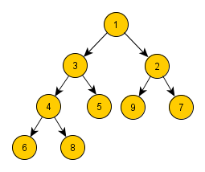

# Cvičení č. 5 – 30.10.2020

## Algoritmizace

### Haldy

[Užitečný text o haldách](https://turing.cz/~tom/efa/texty/20-heap.pdf)

Příklad min-haldy:



Uložení haldy z obrázku: `A = [1, 3, 2, 4, 5, 9, 7, 6, 8]`

**Úkol:** Zapište pseudokódem operace na min-haldě. Haldu máme uloženou v poli A, indexujeme od nuly.

*Pseudokód nemá pevně danou syntaxi; ze zápisu by ale mělo být jasné, jak kód přepsat do konkrétního programovacího jazyka.*


Vrať index rodiče:
```
parent(A, i):
    if i==0:
        return NULL
    return ⌊(i-1) / 2⌋
```

Vrať index levého potomka:
```
left(A, i):
    if 2i + 1 >= size(A):
        return NULL
    return 2i + 1
```

Vrať index pravého potomka:
```
right(A, i):
    if 2i + 2 >= size(A):
        return NULL
    return A[2i + 2]
```

Vlož nový prvek do haldy:
```
insert(A, x):
    append x as the last element of A
    i = last index of A

    while exists parent(A,i) and A[parent(A,i)] > A[i]:
        swap elements at indices i and parent(A,i) in A
        i = parent(A,i)
```

Vyextrahuj minimum z haldy:
```
extractMin(A):
    min = first element of A
    swap first and last element in A
    delete last element of A

    i = 0

    while exists left(i):   # v případě jednoho potomka to bude vždy ten levý
        j = index of min(left(i), right(i))

        if A[j] ≥ A[i]: break
        
        swap elements at indices i and j in A
        i = j

    return min
```

Postav z pole haldu (předpokládáme, že se teď na začátku v poli A nachází prvky v náhodném pořadí).
```
buildHeap(A):
    l = parent(A,last index of A)     # poslední prvek, který má potomka

    for i from l down to 0:         # procházíme od posledního rodiče až po kořen
        while exists left(i):       # pro každý prvek opravíme haldu stejně jako po extrakci minima
            j = index of min(left(i), right(i))

            if A[j] ≥ A[i]: break
            
            swap elements at indices i and j in A
            i = j
```

Setřiď pole od největšího prvku pomocí haldy (pro řazení od nejmenšího prvku bychom použili max-haldu):
```
heapSort(A):
    buildHeap(A)

    for i from size(A) down to 0:
        x = extractMin(A)
        A[i] = x
```

## Programování
- viz [kód](lab05.py)