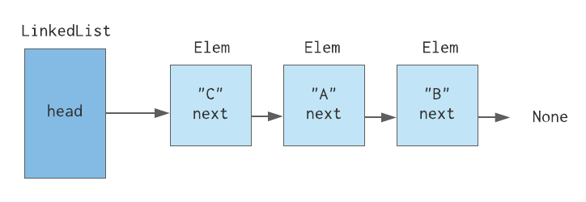

# Cvičení č. 6 – 6.11.2020

## Programování
- viz [kód](lab06.py)

## Algoritmizace

### Spojové seznamy
- seznam s náhodným přístupem
  - O(1) přístup k prvku
  - O(1) přidání / smazání prvku z konce seznamu
  - O(n) přidání / smazání prvku na začátek seznamu (začátek seznamu v paměti je pevně daný, musíme tedy posunout všechny prvky o pozici dál)
  - uloženo v jednom souvislém kuse paměti
- spojový seznam
  - O(n) přístup k prvku
  - O(1) smazání / přidání prvku kdekoliv (stačí přepojit ukazatele)
  - každý prvek je naalokovaný v paměti zvlášť
  - využití např. na implementaci fronty



```python
class LinkedList:
    def __init__(self, head=None):
        self.head = head

class Elem:
    def __init__(self, value=None, next=None):
        self.value = value
        self.next = next

# vytvořit dva prvky, napojit je na sebe
elem1 = Elem()
elem2 = Elem()

elem1.next = elem2

# vytvořit spojový seznam z příkladu
ll = LinkedList()
elem1 = Elem("C")
elem2 = Elem("A")
elem3 = Elem("B")

ll.head = elem1
elem1.next = elem2
elem2.next = elem3

# to samé na jeden řádek
ll_oneliner = LinkedList(Elem("C",Elem("A",Elem("B"))))

# (nyní vše pouze z odkazu na spojový seznam `ll`)
# změnit hodnotu prvního prvku na "D"
ll.head.value = "D"

# změnit hodnotu posledního prvku na "D"
ll.head.next.next.value = "D"

# obecně pro i-tý prvek
current = ll.head

for _ in range(i):
    current = current.next

current.value = "D"

# vymazat první prvek
ll.head = ll.head.next

# přidat prvek před první prvek
new_el = Elem("X")
new_el.next = ll.head
ll.head = new_el
```

### Řazení
- Merge Sort (bez rekurze) - opakování z přednášky
- [Counting Sort](https://www.algoritmy.net/article/106/Counting-sort) - opakování z přednášky
- Bucket Sort
  - data rozdělíme do přihrádek
  - každou přihrádku zvlášť seřadíme (vlastním algoritmem, např. counting sortem)
  - přihrádky postupně vypíšeme
- Radix Sort pro řazení trojmístných čísel
  - čísla rozdělíme do přihrádek postupně podle třetí, druhé a první číslice
  - v každém kroku pracujeme s přihrádkami z předchozího kroku
  - po posledním kroku jsou data seřazená

- [vhodný text k prostudování](https://turing.cz/~tom/efa/texty/06-sort.pdf)
- zadán [domácí úkol](https://github.com/kasnerz/nprg030/blob/master/assignments/02_assignment.pdf)