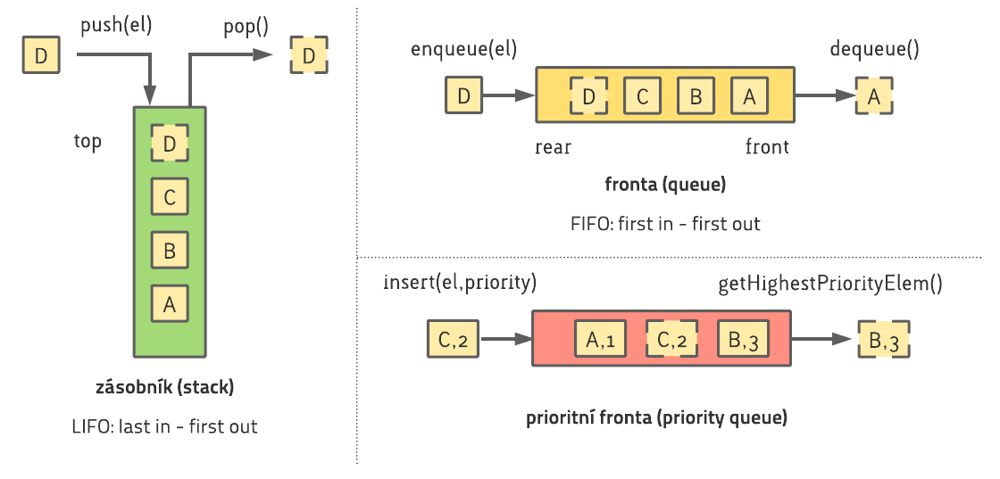
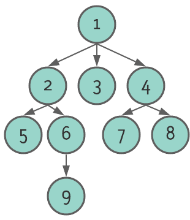

# Cvičení č. 7 – 13.11.2020

## Algoritmizace

### Abstraktní datové struktury
  - definujeme operace, popisujeme chování
  - neřešíme konkrétní implementaci

**Zásobník**
  - operace `push(el)` a `pop()`
  - princip LIFO: last in - first out

**Fronta**
  - operace `enqueue(el)` a `dequeue()`
  - princip FIFO: first in - first out

**Prioritní fronta**
  - operace `insert(el,priority)` a `getHighestPriorityElem()`
  - vrací vždy prvek s nejvyšší prioritou
  

### Aritmetické výrazy
- infixová notace
  - operátor se nachází mezi operandy
  - záleží na prioritě operátorů / uzávorkování
- prefixová (polská) notace
  - operátor se nachází před operandy
  - jednoznačná (nepotřebuje uzávorkování)
- postfixová (reverzní polská) notace
  - operátor se nachází po operandech
  - jednoznačná (nepotřebuje uzávorkování)

#### Příklady
  - infix:  `A * B + C`
  - prefix:  `+ * A B C`  (odpovídá výrazu `sečti(vynásob(A, B), C)`)
  - postfix:  `A B * C +` (odpovídá posloupnosti operací `((A,B -> vynásob),C -> sečti)`)
---
  - infix:  `A * (B + C)`
  - prefix:  `* A + B C`  (odpovídá výrazu `vynásob(A, sečti(B,C)`)
  - postfix:  `A B C + *` (odpovídá posloupnosti operací `(A,(B,C -> sečti) -> vynásob)`)

#### Úkoly
Výrazy mohou obsahovat operátory `+`, `-`, `*`, `/` a číselné operandy. Jednotlivé literály můžete identifikovat pomocí funkcí `is_operator()` a `is_operand()`. Operátor se dvěma operandy můžete vyhodnotit jako `OPERATOR(OPERAND1, OPERAND2)`.

Máte k dispozici zásobník `stack` s funkcemi `push(el)`, `pop()` a `is_empty()`.

**Postfix**
1. Zapište (pseudo)kódem algoritmus pro vyhodnocení výrazu v postfixové notaci.
2. Převeďte ručně výraz `(7 + 3) * (5 - 2)` do postfixové notace.
3. Ukažte jednotlivé kroky Vašeho algoritmu z bodu 1 při vyhodnocení výrazu `(7 + 3) * (5 - 2)` v **postfixové notaci** z bodu 2.

**Prefix**
1. Zapište (pseudo)kódem algoritmus pro vyhodnocení výrazu v prefixové notaci.
2. Převeďte ručně výraz `(7 + 3) * (5 - 2)` do prefixové notace.
3. Ukažte jednotlivé kroky Vašeho algoritmu z bodu 1 při vyhodnocení výrazu `(7 + 3) * (5 - 2)` v **prefixové notaci** z bodu 2.

### Průchod stromem po hladinách

#### Úkol

Strom obsahuje prvky typu `Node`, každý prvek obsahuje hodnotu `value`. Ke stromu můžete přistupovat přes jeho kořen `root` (v příkladu prvek s hodnotou `1`), k potomkům každého prvku můžete přistupovat přes atribut `node.children`.

Máte k dispozici frontu `queue` s funkcemi `enqueue(el)`, `dequeue()` a `is_empty()`. 

1. Zapište (pseudo)kód, který vypíše prvky ve stromu po hladinách (tedy v příkladu v pořadí `1 2 3 4 5 6 7 8 9`).
2. Ukažte jednotlivé kroky Vašeho algoritmu z bodu 1 na stromu z příkladu.

<!-- ## Programování
- viz [kód](lab07.py) -->