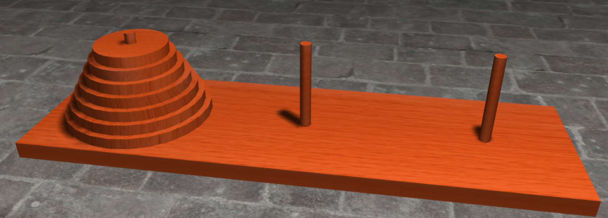

# Cvičení č. 9 – 27.11.2020

## Algoritmizace

### Hanojské věže



http://towersofhanoi.info/Animate.aspx

- originální zadání: 3 tyče (A,B,C), 64 disků různých velikostí
- na začátku jsou všechny disky na tyči A 
- v každém kroku lze přesunout jeden disk
- větší disk nemůže ležet na menším 
- **úkol:** přemístit všechny disky z tyče A na tyč B (C je pomocná tyč)

**Rekurzivní řešení**
- přesuň n-1 disků z tyče A (původní) na tyč C (pomocnou) → vyřeš rekurzivně menší problém
- přesuň n-tý (největší) disk z tyče A na tyč B (cílovou) → jediný krok
- přesuň n-1 disků z tyče C (pomocné) na tyč B (cílovou) → vyřeš rekurzivně menší problém

```python
def hanoi_towers(n, src, dst, aux): 
    if n==1: 
        print("Přesuň disk velikosti", n, "z tyče", src, "na tyč", dst)
        return

    hanoi_towers(n-1, src, aux, dst) 
    print("Přesuň disk velikosti", n, "z tyče", src, "na tyč", dst)
    hanoi_towers(n-1, aux, dst, src) 

hanoi_towers(n, "A", "B", "C")
```

### Pokladna
Vstupenka stojí 100 Kč. U vstupu čeká S lidí, co chtějí zaplatit stokorunou, a D lidí, co chtějí zaplatit dvousetkorunou. Na pokladně není na začátku žádná hotovost. Vypište všechny pořadí, ve kterých mohou lidé přicházet k pokladně, aby bylo možné vracet peníze zpět.

```python
def pokladna(s,d,na_vraceni,lidi):
    if s==0 and d==0:
        print(lidi)

    if s > 0:
        pokladna(s-1,d,na_vraceni+1,lidi+["S"])

    if d > 0 and na_vraceni > 0:
        pokladna(s,d-1,na_vraceni-1,lidi+["D"])

pokladna(S,D,na_vraceni=0,lidi=[])
```

## Programování

### Magic metody
- metody tříd, které (většinou) nevoláme přímo, ale jsou volány interně při nějaké akci (např. metoda `__add__()` se volá při sčítání dvou objektů pomocí operátoru `+`)
- značíme pomocí dvou podtržítek na začátku i na konci
- existující metody u objektu `obj` si můžeme zobrazit pomocí příkazu `dir(obj)`

**Příklady**
- `__add__(obj) -> obj`: sčítání pomocí operátoru `+`
- `__sub__(obj) -> obj`: odčítání pomocí operátoru `-`
- `__mul__(obj) -> obj`: násobení pomocí operátoru `*`
- `__div__(obj) -> obj`: dělení pomocí operátoru `/`
- `__eq__(obj) -> bool`: porovnání pomocí operátoru `==`
- `__ne__(obj) -> bool`: porovnání pomocí operátoru `!=`
- `__lt__(obj) -> bool`: porovnání pomocí operátoru `<`
- `__le__(obj) -> bool`: porovnání pomocí operátoru `<=`
- `__str__() -> str`: čitelná textová reprezentace objektu získaná pomocí funkce `str()` (a také `print()`)
- `__repr__() -> str`: jednoznačná textová reprezentace objektu získaná pomocí funkce `repr()`
- `__contains__(obj) -> bool`: kontrola, zda objekt obsahuje jiný objekt pomocí operátoru `in`
- `__and__(obj) -> obj`: logický AND pomocí operátoru `&`
- `__or__(obj) -> obj`: logický OR pomocí operátoru `|`
- `__len__() -> int`: délka získaná pomocí funce `len()`
- `__hash__() -> str`: unikátní reprezentace objektu (hash), používané např. při přidávání klíče do slovníku
- `__init__(...) -> None`: vytvoření objektu ze třídy pomocí operátoru `()`
- `__call__(...) -> obj`: volání funkce pomocí operátoru `()`

### Dědičnost
- při vytvoření třídy můžeme specifikovat, od jaké třídy je třída odvozena: `class B(A)`
- třídy `B` pak zdědí všechny atributy a metody nadřazené třídy `A`
- atributy a metody nadřazené třídy můžeme libovolně předefinovat
- na nadřazenou třídu se můžeme odkazovat pomocí `super()`
- dědit můžeme i od více tříd najednou (`class C(A,B)`)
- všechny třídy jsou odvozeny od nadtřídy `object`

**Příklad**
```python
class Instrument:
    def __init__(self, price):
        self.price = price

    def get_price(self):
        return self.price

    def get_sound(self):
        # nejjednodušší způsob, jak naznačit, že metoda má být implementovaná v podtřídách
        return NotImplementedError()

class Trumpet(Instrument):
    def get_sound():
        return "tu du dů"

class Guitar(Instrument):
    def __init__(self, price, tuning):
        # předefinovali jsme __init__, ale přiřazení atributu `price` chceme nechat na nadřazené třídě
        super().__init__(price=price)
        self.tuning = tuning

    def get_sound(self):
        return "brnk brnk"

    def get_tuning(self):
        return self.tuning

class ElectricGuitar(Guitar):
    def get_sound(self):
        return "bzzz bzzz"

a = ElectricGuitar(price=5000, tuning="EHGDAE")
print(a.get_sound())
print(a.get_tuning())
```

### Úkoly
1. Vytvořte třídu `Rect` reprezentující obdélník o zadané šířce a výšce.
2. Zařiďte, aby se po zavolání `print(rect)` obdélník vykreslil do terminálu pomocí pomlček "-" a svislítek "|" (nevadí, že řádky budou vyšší).
3. Přidejte metody `perimeter` a `area` pro výpočet obvodu, resp. obsahu obdélníku.
4. Přidejte obdélníku parametry `x` a `y`, které určují, jak daleko je levý horní roh obdélníku od počátku soustavy souřadnic. Aktualizujte funkci pro vykreslování.
5. Zařiďte, aby bylo možné porovnat dva obdélníky pomocí operátoru `==` (dva obdélníky považujeme za shodné, pokud se všechny jejich rohy nacházejí na stejných souřadnicích).
6. Zařiďte, aby operátor `in` použitý na dvou obdélnících vrátil `True` nebo `False` podle toho, jestli je jeden obdélník podmnožinou druhého.
7. Zařiďte, aby operátor `&` použitý na dvou obdélnících vrátil nový obdélník, který je průnikem obou obdélníků (pokrývá vaše řešení všechny případy?)
8. Vytvořte třídu `Square`, která místo šířky a výšky bere pouze délku hrany. Třída bude umět stejné operace jako třída `Rect`.
9. Vytvořte třídu `FilledRect`, která při vykreslování vnitřní plochu obdélníku zaplní pomocí znaku (např. "x").  Třída bude umět stejné operace jako třída `Rect`.
10. Vytvořte třídu `RoundedRect` pro obdélník se zakulacenými rohy (stačí vynechat krajní pomlčky). Třída bude umět stejné operace jako třída `Rect`.
11. Vytvořte třídu `FilledRoundedRect`, která kombinuje vlastnosti předchozích dvou tříd (zamyslete se, jak na to co nejjednodušeji).
12. Nadefinujte funkci `draw(shapes)`, která bere jako argument seznam tvarů a vykreslí je všechny zároveň (přes sebe) do terminálu (nejprve pořádně promyslete). Vykreslete si pár tvarů pro radost a dejte vědět, že máte hotovo.


**Bonus:** Vytvořte třídy `Triangle` (trojúhelník se zadanou výškou) a `Circle` (kruh se zadaným průměrem). Nadefinujte vykreslování do terminálu a další metody.


**Ukázkové výstupy:**
```
print(Rect(x=0, y=0, w=5, h=4))
-------
|     |
|     |
|     |
|     |
-------

print(Rect(x=2, y=1, w=2, h=3))

  ----
  |  |
  |  |
  |  |
  ----

print(Rect(x=2, y=1, w=2, h=3).perimeter())
10

print(Rect(x=2, y=1, w=2, h=3).area())
6

print(Rect(x=0, y=0, w=5, h=8) in Rect(x=3, y=2, w=8, h=3))
False

print(Rect(x=3, y=2, w=2, h=2) in Rect(x=0, y=0, w=8, h=5))
True

print(Rect(x=0, y=0, w=5, h=8) & Rect(x=3, y=2, w=8, h=3))


   ----
   |  |
   |  |
   |  |
   ----

print(Square(x=0, y=0, a=3))
-----
|   |
|   |
|   |
-----

print(FilledRect(x=1, y=1, w=4, h=3))

 ------
 |xxxx|
 |xxxx|
 |xxxx|
 ------

print(RoundedRect(x=0, y=0, w=5, h=2))
 -----
|     |
|     |
 -----

print(FilledRoundedRect(x=1, y=0, w=7, h=2))
  -------
 |xxxxxxx|
 |xxxxxxx|
  -------

draw([
    Rect(x=0, y=0, h=6, w=6),
    RoundedRect(x=3, y=1, h=3, w=18),
    FilledRoundedRect(x=6, y=3, h=5, w=11),
])
--------               
|   ------------------ 
|  |   |              |
|  |   -----------    |
|  |  |xxxxxxxxxxx|   |
|   --|xxxxxxxxxxx|--- 
|     |xxxxxxxxxxx|    
------|xxxxxxxxxxx|    
      |xxxxxxxxxxx|    
       -----------   
```